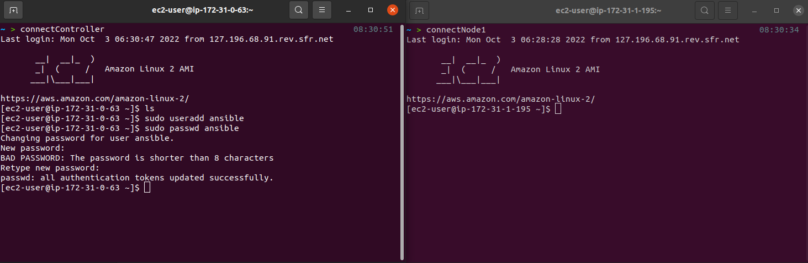

# LABORATORY-ANSIBLE

#### Container

Keep a docker running

```bash
ENTRYPOINT ["tail", "-f", "/dev/null"]
```

Connect to controller

```bash
$ sudo docker exec -it labo-controller /bin/bash
```

### AWS EC2

#### Setting up Ansible

I created two servers EC2 with the same configuration. One of them will be our controller and the second one will be a node.


The first step is to get the PEM keys for the servers. For simplicity, I use the same one for both. Once downloaded, I saved it and change the permissions.

```bash
$ chmod 400 ansible.pem
```


For simplicity, I also setup aliases for connecting either to the controller or the node without tying the full ssh command.


I can now access my two servers. The one on the left is my controller, the one on the right is my node.


I start by creating a new user that we will be using for our setup.

```bash
$ sudo useradd ansible
$ sudo passwd ansible
```



Since I am here, let's put this user has a sudo.

```bash
$ sudo visudo
```


And before going further, let's end that with the installation of ansible.

```bash
$ sudo amazon-linux-extras install epel
$ sudo amazon-linux-extras install ansible2
```


I can switch to my ansible user and check if ansible has been installed properly.

```bash
$ sudo su - ansible
$ ansible --version
```


#### Using Ansible

I will now save the pem file on my controller server. For this either use scp or just create a new file and fill up with the private key.

```bash
$ touch aws.pem
$ vi aws.pem
```

Let's create our inventory with our node. At this step and just for fun, I added another server so you will see how it is to setup for multiples host.

```bash
$ vi ./inventory
```

Where I filled up the following content:

```
[nodes]
ec2-18-237-32-197.us-west-2.compute.amazonaws.com
ec2-54-214-124-124.us-west-2.compute.amazonaws.com
[nodes:vars]
ansible_user=ec2-user
ansible_ssh_private_key_file=/home/ansible/aws.pem
```

And finally, I created my playbook with the content under.

```bash
$ vi ./book.yml
```

```yml
--- # Do things on nodes
- hosts: nodes
  become: yes
  tasks:
    - name: install git
      yum:
        name: git
        state: latest
```

And I am now ready to test using the ansible command.

```bash
$ ansible-playbook -i ./inventory ./book.yml
```


#### Other books for playing

- Run a command and show the result in output

```yml
--- # Do things on nodes
- hosts: nodes
  become: yes
  tasks:
    - name: install git
      yum:
        name: git
        state: latest
    - name: run script
      command: sh ansible.sh
      register: command_output
      args:
        chdir: scripts/
    - debug:
        var: command_output.stdout_lines
```

- Copy files from controller to nodes

```yml
--- # Copy file from master to remote
- hosts: nodes
  become: yes
  tasks:
    - name: copy file
      copy: src=/home/ansible/testcopy
        dest=/home/ansible/trol
```
